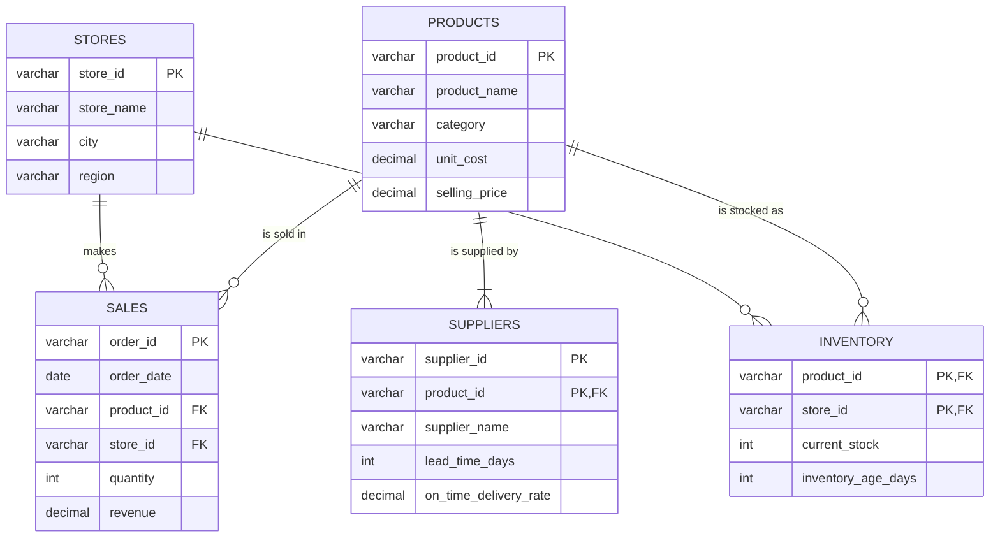

# Data Dictionary: Urban Retail Co.

This document describes the five raw datasets in `data/raw/`. They were generated by `scripts/generate_data.py` (fixed random seed 42) and contain synthetic data for the fictional company **Urban Retail Co.**

| File | Rows | One row represents | Table type |
|---|---|---|---|
| `products.csv` | 1,000 | One product in the catalogue | Dimension (master data) |
| `stores.csv` | 26 | One retail store | Dimension (master data) |
| `suppliers.csv` | 1,262 | One supplier supplying one product | Bridge / reference |
| `sales.csv` | 60,000 | One sales order line | Fact (transactions) |
| `inventory.csv` | 19,038 | Current stock of one product at one store | Fact (snapshot) |

---

## Key terms

| Term | Meaning |
|---|---|
| **Primary key (PK)** | Column (or set of columns) that uniquely identifies each row. Never blank, never repeated. |
| **Composite key** | A primary key made from two or more columns together, because no single column is unique on its own. |
| **Foreign key (FK)** | Column that points to the primary key of another table. This is how tables are joined. |
| **Metric** | A number you can add up, average, or calculate with (e.g. revenue, quantity). |
| **Dimension** | A category you group or filter by (e.g. region, category, date). |
| **Descriptive field** | Human-readable text that labels a record (e.g. a name). Useful for display, not for grouping or calculations. |
| **Fact table** | Stores events or measurements (sales, stock levels). Usually large. |
| **Dimension table** | Stores the "who / what / where" that describe facts (products, stores). Usually small. |

---

## 1. `products.csv`

The product catalogue. Each product appears exactly once.

**Grain:** one row per product. **Primary key:** `product_id`.

| Column | Business meaning | Data type | Role | Connects to |
|---|---|---|---|---|
| `product_id` | Unique code for each product, e.g. `P0001`. | Text: `VARCHAR(10)` | **Primary key** | `suppliers.product_id`, `sales.product_id`, `inventory.product_id` |
| `product_name` | Display name of the product: brand + item + model, e.g. `Nova Wireless Earbuds K160`. | Text: `VARCHAR(100)` | Descriptive field | (none) |
| `category` | Product group the item belongs to. 8 values: Apparel, Grocery, Home & Kitchen, Electronics, Beauty & Personal Care, Sports & Fitness, Stationery, Toys & Games. | Text: `VARCHAR(50)` | Dimension | (none) |
| `unit_cost` | What Urban Retail Co. pays the supplier for one unit, in Indian Rupees (INR). Range ₹24.59 to ₹21,581.75. | Decimal: `DECIMAL(10,2)` | Metric | Used with `sales.quantity` to calculate cost of goods sold |
| `selling_price` | The list price a customer pays for one unit before any discount, in INR. Always ends in 9 (e.g. ₹499). Range ₹49 to ₹24,819. Always higher than `unit_cost`. | Decimal: `DECIMAL(10,2)` | Metric | Used with `sales.quantity` to compare list price against actual `revenue` |

---

## 2. `stores.csv`

The list of Urban Retail Co. stores across India.

**Grain:** one row per store. **Primary key:** `store_id`.

| Column | Business meaning | Data type | Role | Connects to |
|---|---|---|---|---|
| `store_id` | Unique code for each store, e.g. `S001`. | Text: `VARCHAR(10)` | **Primary key** | `sales.store_id`, `inventory.store_id` |
| `store_name` | Display name of the store, e.g. `Urban Retail - Andheri`. | Text: `VARCHAR(100)` | Descriptive field | (none) |
| `city` | City where the store is located. 22 cities; some cities (New Delhi, Mumbai, Bengaluru, Kolkata) have 2 stores. | Text: `VARCHAR(50)` | Dimension | (none) |
| `region` | Broad geographic area of India: North (7 stores), South (6), West (5), East (5), Central (3). | Text: `VARCHAR(20)` | Dimension | (none) |

---

## 3. `suppliers.csv`

Which supplier provides which product, and how reliable that supplier is.

**Grain:** one row per supplier-product pair. **Primary key:** composite of `supplier_id` + `product_id`.

There are 40 suppliers. Each supplier serves products from one category. Every product has at least one supplier, and 262 products have a second (backup) supplier, so a `product_id` can appear up to **twice** in this table.

| Column | Business meaning | Data type | Role | Connects to |
|---|---|---|---|---|
| `supplier_id` | Unique code for each supplier, e.g. `SUP001`. Repeats on every row for the products that supplier provides. | Text: `VARCHAR(10)` | **Part of composite primary key**; identifies the supplier | (none; there is no separate supplier master table) |
| `supplier_name` | Business name of the supplier, e.g. `Bharat Traders`. Always the same for a given `supplier_id`. | Text: `VARCHAR(100)` | Descriptive field | (none) |
| `product_id` | The product this supplier provides. | Text: `VARCHAR(10)` | **Foreign key** + part of composite primary key | `products.product_id` |
| `lead_time_days` | Number of days between placing a purchase order and receiving the goods. Lower is better. Range 2 to 22 days. | Whole number: `INT` | Metric | Indirectly to `inventory` (long lead times + low stock = higher stockout risk) |
| `on_time_delivery_rate` | Share of deliveries that arrive on or before the promised date. Stored as a **fraction from 0 to 1**, not a percentage: `0.84` means 84%. Higher is better. Range 0.568 to 0.990. | Decimal: `DECIMAL(4,3)` | Metric | (none) |

---

## 4. `sales.csv`

Every sales transaction from 1 January 2025 to 31 December 2025.

**Grain:** one row per order line (one product, at one store, on one date). **Primary key:** `order_id`.

| Column | Business meaning | Data type | Role | Connects to |
|---|---|---|---|---|
| `order_id` | Unique code for each order, e.g. `ORD000001`. Numbered in date order. | Text: `VARCHAR(12)` | **Primary key** | (none) |
| `order_date` | Calendar date the sale happened, format `YYYY-MM-DD`. 365 unique dates covering all of 2025. **Loaded as text by default**, so convert it to a date before analysis. | Date: `DATE` | Dimension (time) | A date / calendar table, if you create one in Power BI |
| `product_id` | The product that was sold. 994 of the 1,000 products have at least one sale. | Text: `VARCHAR(10)` | **Foreign key** | `products.product_id` |
| `store_id` | The store where the sale happened. | Text: `VARCHAR(10)` | **Foreign key** | `stores.store_id` |
| `quantity` | Number of units sold in this order line. Always a positive whole number, from 1 to 11. | Whole number: `INT` | Metric | (none) |
| `revenue` | Money received for this order line, in INR, **after discount**. Equal to `quantity × selling_price × (1 − discount)`, where the discount is 0%, 5%, 10% or 20%. The discount itself is not stored. | Decimal: `DECIMAL(12,2)` | Metric | Compare with `products.selling_price × quantity` to estimate the discount given |

---

## 5. `inventory.csv`

A snapshot of how much stock each store currently holds of each product it carries. There is no date column; treat it as stock **at the end of the sales period (31 December 2025)**.

**Grain:** one row per product per store. **Primary key:** composite of `product_id` + `store_id`.

Not every store carries every product. Stores carry between 559 and 967 products, depending on store size.

| Column | Business meaning | Data type | Role | Connects to |
|---|---|---|---|---|
| `product_id` | The product being stocked. | Text: `VARCHAR(10)` | **Foreign key** + part of composite primary key | `products.product_id` |
| `store_id` | The store holding the stock. | Text: `VARCHAR(10)` | **Foreign key** + part of composite primary key | `stores.store_id` |
| `current_stock` | Number of units on hand right now. Range 0 to 150. `0` means the product is **out of stock** at that store. | Whole number: `INT` | Metric | Compare with `sales.quantity` totals to judge overstock or stockout risk |
| `inventory_age_days` | Average number of days the current stock has been sitting in the store. Higher values mean older stock that may be hard to sell. Range 1 to 540 days. | Whole number: `INT` | Metric | (none) |

---

## How the tables relate



| Relationship | Type | Join on | Meaning |
|---|---|---|---|
| `products` → `sales` | One-to-many | `product_id` | One product can be sold many times. Each sale is for exactly one product. |
| `stores` → `sales` | One-to-many | `store_id` | One store makes many sales. Each sale happens at exactly one store. |
| `products` → `inventory` | One-to-many | `product_id` | One product can be stocked at many stores (11 to 26). |
| `stores` → `inventory` | One-to-many | `store_id` | One store holds stock of many products. |
| `products` → `suppliers` | One-to-many (1 or 2) | `product_id` | Every product has 1 or 2 suppliers. |
| Suppliers ↔ products | Many-to-many | via `suppliers` table | One supplier provides many products; some products have two suppliers. |
| `sales` ↔ `inventory` | Indirect | `product_id` **and** `store_id` together | Every sale's product-store pair exists in `inventory`. Compare total units sold with current stock to see how many days of stock remain. |
| `suppliers` ↔ `sales` / `inventory` | Indirect | through `product_id` | Links supplier performance to sales and stock levels. |

### Star schema view (for Power BI)

`sales` and `inventory` are **fact tables** in the middle. `products` and `stores` are **dimension tables** that filter them. `suppliers` hangs off `products`.

```
                 stores
                /      \
           sales        inventory
                \      /
                products
                    |
                suppliers
```

---

## Watch-outs before analysis

1. **Double counting with suppliers.** 262 products have two suppliers. If you join `sales` directly to `suppliers`, those products' sales rows get duplicated and revenue is overstated. Aggregate first (e.g. total sales per product), or pick one supplier per product, before joining.
2. **`order_date` is text** when loaded with default settings in pandas or Excel. Convert it to a real date type.
3. **`on_time_delivery_rate` is a fraction**, not a percentage. Multiply by 100 for display, or format as a percentage.
4. **`revenue` already includes discounts.** For profit, use `revenue − (quantity × unit_cost)`, not `selling_price − unit_cost`.
5. **No supplier master table.** `supplier_name` is repeated on each row of `suppliers`. Use `SELECT DISTINCT supplier_id, supplier_name` to get a clean supplier list.
6. **Inventory has no date.** It is a single point-in-time snapshot, so you cannot track stock changes over time.
7. **Joining `sales` to `inventory` needs both keys.** Joining on `product_id` alone would match every store's stock to every store's sales.
8. **Products without sales.** 6 products have stock but zero sales in 2025. A `LEFT JOIN` from `products` or `inventory` keeps them; an `INNER JOIN` to `sales` silently drops them.
